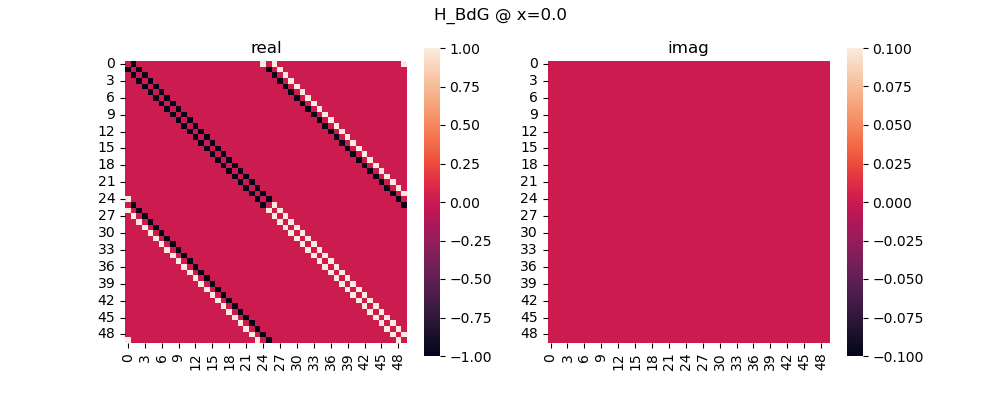

# Intro
Some scripts for visualizing energy modes in 1d systems, written as supplement as I followed along with the [Topocondmat course](https://topocondmat.org/w1_topointro/1D.html).

# Scripts
### majorana_modes.py
Main script. Plot the energy levels for Kitaev or SSH chain. Parameters can also be tweaked via command line args.

### majorana_modes_nb.ipynb
Notebook version of the Demo section of this README, with more examples and comments.

### Examples:
```
# 1. Plot energies for Kitaev model as mu/t is tuned
python majorana_modes.py kitaev

# 2. as last-to-first-site hopping is tuned (default mu/t=0)
python majorana_modes.py kitaev --tune x 

# 3. with mu/t set at 3
py majorana_modes.py kitaev --tune x -m 3.0

# 4. Plot energies for SSH model as t2/t1 is tuned
python majorana_modes.py ssh 
```
In SSH model case, default tuning parameter is `t2/t1`  (ratio of the two hopping strengths). But you can also specify `--tune x` to tune the strength of periodic hopping in SSH model.

#### Optional args:
- `-N` (default `25`): Set number of sites
- `-m` (default `1`): Set onsite-energy mu value (ignored if mu is being tuned)
- `-d` (default `1`): Set value of Cooper pairing
- `-t` (default `1`): Set value of next-neighbor hopping (ignored if ssh model)
- `-x` (default `0.5`): Set parameter tuning last-to-first-site hopping. 
- `-t2` (default `1`): Set value of double-bond hopping (single-bond is always 1)
- `--plot-band-idxs` (default `0 1`): plot spatial distribution of these eigenstates, indexed by number (e.g. `0 1 2` includes third-lowest state).
- `--enforce-even-sites` (default `False`): in SSH model, enforce an even number of C-sites in the system.

# Demo:
Plot the energy bands for the 1d Kitaev chain as the ratio (mu/t) of on-site energy to nearest-neighbor hopping is tuned:
```
python majorana_modes.py kitaev -N 25 --show-ham --plot-band-idxs 0 1 2
```
Outputs:


On the left side we see the similar band structure plotted in Topocondmat. On the right side is the spatial distribution of some of the lowest-energy majorana pairs.

Things to note:
1. At the highest `mu/t=3`, the individual majoranas are all paired up (completely overlapping spatial distribution), and their distributions just look like the regular ground/excited-state energies of an infinite potential well.

2. As we go toward smaller `mu/t`, the lowest-energy pair seem to get pushed out toward the ends of the chain, and at `mu/t=1` they seem almost completely localized to the ends.

3. As we get to even closer to `mu/t=0`, while staying localized at the ends, the indivial majoranas of the lowest-energy pair start to become more and more spatially separated.

The plots above only speak to a finite system of N atomic sites in total. However, we can make our system periodic simply by adding a hopping term between the last and first site. Now we can apply it to talk about bulk properties of macroscopic systems.

Let's see how the system evolves as we tune the strength of last-to-first-site hopping `t' = t(1 - 2*x)`, where `t` is regular nn-hopping. We will scan parameter `x` from 0 to 1:
```
python majorana_energies.py kitaev -N 25 --tune x -m 0.0001 --plot-band-idxs 0 1 2 
```



Things to note:

1. At `x=0` we have `t'=t`: periodic hopping strength is indistinguishable from regular nn-hopping. The system is gapped, and lowest-energy states have wavelengths of `L/0` (inf) and `L/2`.
2. At the other end `t'=-t`: periodic hopping has opposite sign from regular nn-hopping. The system is also gapped here, and lowest-energy modes have wavelengths of `L/1` and `L/3`. 
3. As we start at either end `x=0` or `x=1` and move toward `x=0.5` (where `t'=0`, open chain), the lowest-energy modes have wavelengths `L/1` and `L/2`, with a non-sinusoidal lowest-energy mode localized to the 1st and last sites.
4. Right at `x=0.5`, the majoranas of the lowest-energy mode become unpaired and reside at opposite ends of the periodic cell. 

 Unlike the previous spatial distribution plots that represented the entire system, the distributions here represent only the periodic part of the whole system. Now considering the unpaired majoranas from `4.` in the entire bulk system, the unpaired majorana from the last site of one cell will simply pair up with the unpaired majorana of the next cell -- however we will still end up with two unpaired majoranas, one at each end of the bulk system.

